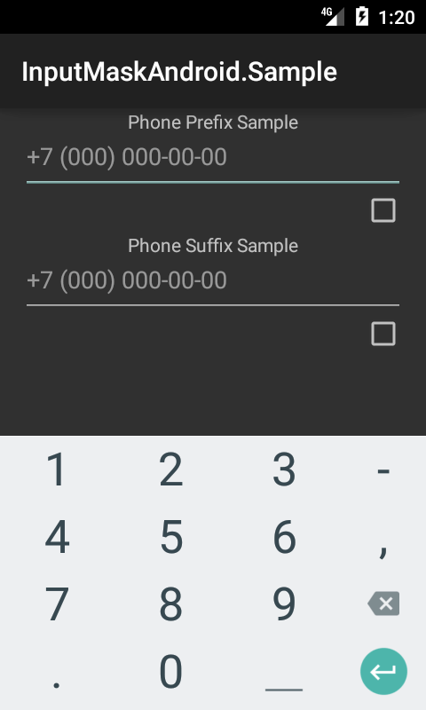

# Input Mask Android Xamarin Binding

A binding library for https://github.com/RedMadRobot/input-mask-android

[]() []()

Available on NuGet: [](https://www.nuget.org/packages/Xamarin.Bindings.Input-Mask-Android/)

## Preview

[]()

## Installing

Add [NuGet package](https://www.nuget.org/packages/Xamarin.Bindings.Input-Mask-Android) to your Xamarin.Android project

```
PM> Install-Package Xamarin.Bindings.Input-Mask-Android
```

## Usage

Add to your view code behind file:

```csharp
var editText = FindViewById<EditText>(Resource.Id.edit_text);
var listener = MaskedTextChangedListener.Companion.InstallOn(editText,
    "+7 ([000]) [000]-[00]-[00]",
    new ValueListener((maskFilled, extractedValue, formattedValue) =>
    {
        LogValueListener(maskFilled, extractedValue, formattedValue);
    }));
```

Please visit the original library [description](https://github.com/RedMadRobot/input-mask-android) and 
[wiki page](https://github.com/RedMadRobot/input-mask-android/wiki) for details of usage and possible issues.

## Try this library in action!

Build and deploy [InputMask.Sample](InputMask.Sample) project to your android device/emulator.

## Copyright

* **Vadim Sedov** - *Binding library & sample port* - [SIDOVSKY](https://github.com/SIDOVSKY)
* **RedMadRobot** - *Input Mask Android java library* - [RedMadRobot](https://github.com/RedMadRobot)

See the [NOTICE](NOTICE) file for details.

## License

This project is licensed under the MIT License. See the [LICENSE](LICENSE) file for details.